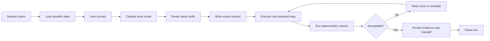

<div align="center">

# Escapement

### A runtime harness for disciplined AI-assisted software delivery.

Escapement gives coding agents durable project state, task-aware skill routing,
approval gates, deterministic validation, and evidence-backed handoffs.

[](https://github.com/SiddheshKGupta/escapement/actions/workflows/validate-standard.yml)
[](CHANGELOG.md)
[](https://www.python.org/)
[](https://developers.openai.com/codex/)
[](https://docs.anthropic.com/en/docs/claude-code/)
[](LICENSE.md)

**Understand enough. Decide enough. Build. Test. Prove. Persist.**

[Quick start](#quick-start) ·
[How it works](#how-it-works) ·
[Skills](#native-skills) ·
[Commands](#commands) ·
[Contributing](CONTRIBUTING.md)

</div>

---

## Why “Escapement”?

In a mechanical watch, an escapement turns stored energy into controlled,
measurable movement.

This project applies the same idea to AI coding agents:

```text
Unbounded generation
        ↓
Context → Route → Execute → Validate → Persist
        ↓
Controlled delivery
```

AI agents can generate code quickly. Reliable delivery also needs durable
decisions, scoped work, explicit permissions, tested edge states, traceable
evidence, and a handoff the next session can use.

Escapement makes those behaviours structural instead of optional.

---

## What Escapement does

| Capability | Purpose |
|---|---|
| **Durable state** | Keeps project facts, current work, and handoffs outside chat history |
| **Work-mode routing** | Classifies work as `FULL`, `DELTA`, or `EXECUTE` |
| **Native skills** | Selects the smallest relevant specialist skill stack |
| **Lifecycle hooks** | Injects context at session start, prompt submission, and attempted stop |
| **Approval gates** | Pauses before sensitive or materially irreversible changes |
| **Deterministic checks** | Runs tests and machine checks before subjective model review |
| **Evidence records** | Captures outputs, checks, skipped checks, and evidence paths |
| **Design intelligence** | Guides enterprise UI, brand, layout, motion, and `DESIGN.md` |
| **Fresh-install validation** | Tests both the standard repository and installed project profile |
| **Progressive disclosure** | Loads only the instructions needed for the current task |

---

## Support matrix

| Runtime | Support | Integration |
|---|---|---|
| **Codex** | First-class | `AGENTS.md`, `.codex/hooks.json`, `.agents/skills/` |
| **Claude Code** | First-class | `CLAUDE.md`, `.claude/settings.json`, `.claude/skills/` |
| **Cursor / Cline / Roo Code** | Manual / compatibility mode | `AGENTS.md` plus `manual-start` |
| **GitHub-only or ordinary web chat** | Manual mode | Runtime commands must be executed separately |

Escapement uses only the Python standard library. It has no third-party Python
package dependencies.

### Requirements

- Python 3.10 or later
- Git
- Codex or Claude Code for first-class hook execution

---

## The most important rule

Escapement must be installed **inside the repository being built**.

```text
my-product/
├── AGENTS.md
├── CLAUDE.md
├── PROJECT_STATE.yaml
├── PROJECT_CONTEXT.md
├── .agents/
├── .claude/
├── .codex/
├── docs/
├── scripts/
└── src/
```

A separate Escapement checkout does not automatically govern another repository.

---

# Quick start

## 1. Clone Escapement

```bash
git clone https://github.com/SiddheshKGupta/escapement.git
cd escapement
```

## 2. Install it into a product repository

```bash
python scripts/vlco_build.py init /path/to/your-product
```

Windows:

```powershell
py -3 scripts/vlco_build.py init C:\path\to\your-product
```

The installer copies the runtime, standards, templates, native skills, schemas,
and behaviour scenarios. It also writes `.vlco-build.json` with the installed
version and source.

## 3. Configure the product

Open the installed `PROJECT_STATE.yaml` and replace the template values.

A safe starting state is:

```yaml
project_name: My Product
phase: discovery
work_mode: FULL
implementation_authorized: false
approved_ticket: null

blocking_decisions: []
accepted_assumptions: []
selected_skills: []

runtime:
  version: "5.4.1"
  enabled: true
  last_closed_turn: null
```

Then add the known product facts to `PROJECT_CONTEXT.md`.

Do not invent missing business rules. Leave unresolved items explicit.

## 4. Verify the installation

From the product repository:

```bash
python scripts/vlco_build.py doctor
```

Expected result:

```text
Failures: 0
```

The doctor checks the environment, standard profile, runtime wiring, native
skills, and evidence structure.

## 5. Approve the hooks

### Codex

Open the product repository in Codex and review the project hooks:

```text
/hooks
```

Project skills live in:

```text
.agents/skills/
```

### Claude Code

Start Claude Code from the product repository:

```bash
claude
```

Review the shared project settings in:

```text
.claude/settings.json
```

Project skills live in:

```text
.claude/skills/
```

## 6. Start with orientation

```text
Read AGENTS.md, PROJECT_STATE.yaml, PROJECT_CONTEXT.md,
.agent/runtime/ACTIVE_CONTEXT.md,
.agent/runtime/ACTIVE_SKILLS.md, and
.agent/runtime/SESSION_MEMORY.md.

Do not build yet.

Tell me:
1. the current project and phase;
2. the recommended work mode;
3. the selected skills;
4. the material unknowns;
5. the approval gates;
6. whether the runtime is active.
```

---

# How it works



The lifecycle is driven by three hook events:

```text
SessionStart
→ Load project state and previous handoff

UserPromptSubmit
→ Classify mode, select skills, and write active context

Stop
→ Block one premature completion when a material turn is still open
```

The Stop gate blocks at most once. It cannot create an infinite loop.

---

## Work modes

| Mode | Use | Behaviour |
|---|---|---|
| `FULL` | New product, module, architecture, or major workflow | Discovery and readiness gate before implementation |
| `DELTA` | Material change to an existing product | Impact review and approval before the change |
| `EXECUTE` | Approved ticket, isolated bug, or bounded change | Confirm files, acceptance, and checks; then implement |

### `FULL`

```text
Inspect → Discover → Decide → READY CHECK → Approve → Build
```

### `DELTA`

```text
Read state → Assess impact → Approve change → Build
```

### `EXECUTE`

```text
Confirm ticket → Change files → Test → Persist
```

---

# Native skills

Escapement currently ships eight skills. The router selects at most four for a
material turn.

| Skill | Owns |
|---|---|
| `project-discovery` | Scope, unknowns, decisions, risks, and readiness |
| `dashboard` | KPI contracts, MIS, analytics, drill-down, and reconciliation |
| `workflow` | States, actors, approvals, exceptions, SLAs, and audit |
| `design-system` | Brand, colour, typography, layout, motion, and `DESIGN.md` |
| `enterprise-ui-review` | Hierarchy, density, states, accessibility, and usability |
| `api-integration` | External contracts, auth, retries, idempotency, and monitoring |
| `release-readiness` | UAT, production, rollback, monitoring, and handover |
| `skill-governance` | Selection, overlap, evidence, scoring, and improvement |

The source of truth is:

```text
skills/<skill>/SKILL.md
```

Native copies are generated into:

```text
.claude/skills/<skill>/SKILL.md
.agents/skills/<skill>/SKILL.md
```

After editing a skill:

```bash
python scripts/vlco_build.py sync-skills
```

Validation fails when native copies drift from `skills/`.

---

## Example routing

### New product

```text
I want to build a Subvention Management Platform.

First understand the users, workflows, data, approvals, reporting,
permissions, integrations, security, and design direction.

Do not implement until the READY CHECK is approved.
```

Expected:

```text
Mode: FULL
Skills: project-discovery, workflow, skill-governance
```

### Management dashboard

```text
Build a management dashboard for subvention claims.

Show claim value, approved amount, collected amount, outstanding amount,
ageing, recovery rate, source records, freshness, filters,
reconciliation, and drill-down.

Use the client brand and avoid generic AI styling.
```

Expected:

```text
Skills: dashboard, design-system, enterprise-ui-review, skill-governance
```

### External integration

```text
Integrate the product with the lease management system.

Before coding, define authentication, permissions, request and response
contracts, validation, idempotency, retries, timeouts, error handling,
audit events, monitoring, and fallback behaviour.
```

Expected:

```text
Skills: api-integration, skill-governance
```

---

# Durable state

During a material turn, Escapement writes:

```text
.agent/runtime/ACTIVE_CONTEXT.md
.agent/runtime/ACTIVE_SKILLS.md
.agent/runtime/current-turn.json
```

When the turn closes, it updates:

```text
.agent/runtime/SESSION_MEMORY.md
.agent/runtime/turns.jsonl
SESSION_HANDOFF.md
logs/skill-usage.jsonl
```

`SESSION_HANDOFF.md` is the shared, human-readable continuation record.
The `.agent/runtime/` directory is local runtime state by default.

---

# Closing a turn

A material turn should close with an explicit summary, next action, checks, and
evidence:

```bash
python scripts/agent_runtime.py close-turn \
  --summary "KPI catalogue and dashboard specification completed" \
  --next "Implement the approved dashboard shell" \
  --files "DESIGN.md,docs/KPI_CATALOGUE.md" \
  --checks "KPI contract review;design review" \
  --evidence "DESIGN.md,docs/KPI_CATALOGUE.md"
```

If hooks are unavailable, open the turn manually:

```bash
python scripts/agent_runtime.py manual-start \
  --prompt "Build the management dashboard"
```

---

# Design intelligence

For UI work, create or update a product-level:

```text
DESIGN.md
```

Start from:

```text
docs/templates/DESIGN.template.md
```

Use:

```text
docs/standards/design-intelligence.md
```

The design standard covers:

- product and user context;
- client-brand precedence;
- design archetypes;
- colour tokens;
- typography;
- spacing and geometry;
- buttons and states;
- tables and operational density;
- charts and reporting;
- motion;
- responsive behaviour;
- accessibility.

External references provide principles, not protected brand assets.

---

# Commands

## Build CLI

```bash
python scripts/vlco_build.py <command>
```

| Command | Purpose |
|---|---|
| `init <target>` | Install Escapement into a project |
| `doctor` | Run environment, validation, and runtime checks |
| `validate` | Run deterministic standard validation |
| `context` | Build a task-scoped context pack |
| `skill-audit` | Validate and summarise skill evidence |
| `handoff` | Generate a compact session handoff |
| `sync-skills` | Regenerate native skill copies |
| `update <target>` | Preview drift between this checkout and an install |
| `version` | Print the framework version |

Preview an installed project:

```bash
python scripts/vlco_build.py update /path/to/your-product
```

Use project backups and review changes before applying framework updates.

## Runtime CLI

```bash
python scripts/agent_runtime.py <command>
```

| Command | Purpose |
|---|---|
| `session-start` | Load session memory |
| `prompt` | Route a hook-submitted prompt |
| `manual-start` | Open a turn without hooks |
| `status` | Inspect the current turn |
| `stop` | Apply the one-shot completion gate |
| `close-turn` | Persist closure, evidence, and handoff |
| `reset-turn` | Clear a stale open turn |
| `doctor` | Verify runtime wiring |

---

# Validation

Run:

```bash
python scripts/vlco_build.py validate
```

The validator checks:

- required root files;
- manifest paths;
- version consistency;
- document line budgets;
- skill frontmatter;
- duplicate skill names;
- native skill synchronisation;
- internal Markdown links;
- project-state structure;
- skill-evidence records;
- evidence-path existence;
- context-pack budget;
- required behaviour scenarios;
- release placeholders.

CI also runs the runtime unit tests and validates a fresh installation.

---

# Project layout

```text
.
├── AGENTS.md
├── AGENT_RUNTIME.md
├── CLAUDE.md
├── PROJECT_STATE.yaml
├── PROJECT_CONTEXT.md
├── CURRENT_PHASE.md
├── SESSION_HANDOFF.md
├── manifest.json
│
├── .agents/                 # Codex-native skills
├── .claude/                 # Claude Code settings and skills
├── .codex/                  # Codex hooks
├── .github/                 # CI and contribution templates
│
├── docs/
│   ├── standards/
│   ├── templates/
│   ├── checklists/
│   └── decisions/
│
├── skills/                  # canonical skill definitions
├── scripts/                 # CLI, runtime, validation, and context tools
├── schemas/                 # evidence schemas
├── tests/                   # runtime tests and behaviour scenarios
├── examples/                # worked enterprise dashboard example
├── reports/                 # skill health and effectiveness
└── logs/                    # skill evidence
```

---

# Security and trust

Escapement installs project hooks that execute repository-local Python.

Review the following before approving a cloned repository:

```text
.codex/hooks.json
.claude/settings.json
scripts/agent_runtime.py
```

Approval gates apply before:

- schema migrations;
- authentication or RBAC changes;
- destructive actions;
- production deployment;
- paid services;
- new external integrations;
- confidential-data access;
- material scope changes;
- broad refactors;
- licence-sensitive reuse.

Never treat a hook approval as permission for unrestricted repository changes.

---

# Current status

Escapement is under active development.

The runtime, native skill sync, standard/project validation profiles, and fresh
installation checks are implemented. Broader cross-platform hardening,
structured check evidence, safer framework upgrades, and executable behaviour
evaluation remain roadmap items.

---

# Roadmap

- [x] Progressive-disclosure operating standard
- [x] Durable runtime state and handoff
- [x] Native Codex and Claude Code skills
- [x] Prompt-based work-mode and skill routing
- [x] One-shot completion gate
- [x] Standard and installed-project validation profiles
- [x] Native skill synchronisation
- [x] Design intelligence
- [x] Runtime unit tests and fresh-install CI
- [ ] Safe managed-file upgrade system
- [ ] Structured command evidence with exit codes and hashes
- [ ] Executable behaviour-scenario evaluation
- [ ] Cross-platform hook launcher
- [ ] Tagged releases and packaged CLI
- [ ] Organisation policy overlays
- [ ] MCP server and cross-project health reporting

---

# Contributing

Escapement favours a small, enforceable standard over a large instruction
library.

Before proposing a change:

1. show a real failure, repeated correction, or measurable need;
2. place the change in the smallest correct layer;
3. check for overlap;
4. update the relevant test or behaviour scenario;
5. update the changelog;
6. run the doctor.

See [CONTRIBUTING.md](CONTRIBUTING.md).

---

# Licence

Escapement is **source-available, not open source**.

The repository is publicly viewable for reference, evaluation, and learning.
Internal use is permitted under the terms in [LICENSE.md](LICENSE.md).
Commercial redistribution, resale, white-labelling, and substantial
republication require permission from V L & CO.

See [NOTICE.md](NOTICE.md) for attribution and third-party notices.

---

<div align="center">

Built by **V L & CO**

**Judgement before answers. Evidence before opinion. Verification before confidence.**

</div>
