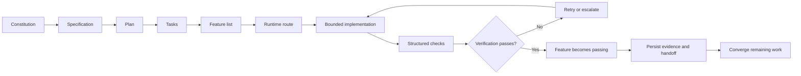

<div align="center">

# Escapement

### A runtime harness for disciplined AI-assisted software delivery.

Escapement turns capable coding agents into a controlled delivery system with
durable project state, executable specifications, skill routing, approval
gates, evidence-backed verification, security controls, and clean handoffs.

[](docs/releases/v6.0.0.md)
[](https://www.python.org/)
[](https://developers.openai.com/codex/)
[](https://docs.anthropic.com/en/docs/claude-code/)
[](LICENSE.md)

**Understand enough. Decide enough. Build. Test. Prove. Persist.**

[Quick start](#quick-start) ·
[Workflow](#the-delivery-workflow) ·
[Skills](#native-skills) ·
[Components](#extensions-presets-and-bundles) ·
[Commands](#commands) ·
[Security](SECURITY.md)

</div>

---

## Why “Escapement”?

A mechanical escapement converts stored energy into controlled, measurable
movement.

Escapement applies the same principle to AI coding agents:

```text
Unbounded generation
        ↓
Specify → Route → Execute → Verify → Persist
        ↓
Controlled delivery
```

Agents can generate code quickly. Reliable delivery also requires a shared
definition of done, durable decisions, limited scope, explicit permissions,
runtime evidence, and a handoff the next session can trust.

---

## What Escapement provides

| Capability | What it enforces |
|---|---|
| **Repository as system of record** | State and decisions live in files, not only chat |
| **Executable specification flow** | Constitution → spec → plan → tasks → implement → converge |
| **Feature-state gating** | Features reach `passing` only after their verification command passes |
| **Work-mode routing** | Every material task becomes `FULL`, `DELTA`, or `EXECUTE` |
| **Native skill routing** | Codex and Claude Code receive the smallest useful skill stack |
| **Open-turn continuity** | A later prompt continues an open turn instead of silently replacing it |
| **Structured evidence** | Checks record commands, exit codes, output paths, timestamps, and hashes |
| **One-shot completion gate** | One premature stop is blocked without creating an infinite loop |
| **Safe installation and updates** | Framework-owned files update; project-owned files are preserved |
| **Doctor and repair** | Detects and repairs missing or drifted framework files |
| **Executable evaluations** | Router and runtime behaviours are tested from fixtures |
| **Security gate** | Scans hooks, MCP config, secrets, permissions, and risky commands |
| **Local observability** | Run records and evidence remain local and can be viewed in a browser |
| **Design intelligence** | Enterprise design standards and product-specific `DESIGN.md` |
| **Extensions, presets, bundles** | Optional capabilities and role-based setups without bloating core |
| **Optional research grounding** | Perplexity MCP integration remains separate from the core runtime |

Escapement uses the Python standard library only. Optional extensions may have
their own requirements.

---

## Support matrix

| Runtime | Support | Integration |
|---|---|---|
| **Codex** | First-class | `AGENTS.md`, `.codex/hooks.json`, `.agents/skills/` |
| **Claude Code** | First-class | `CLAUDE.md`, `.claude/settings.json`, `.claude/skills/` |
| **Cursor / Cline / Roo Code / other IDE agents** | Compatibility mode | `AGENTS.md` plus manual runtime start |
| **Ordinary web chat or GitHub-only access** | Manual mode | Runtime commands must be executed separately |

---

## The most important rule

Escapement must be installed inside the repository being built.

```text
my-product/
├── AGENTS.md
├── CLAUDE.md
├── PROJECT_STATE.yaml
├── PROJECT_CONTEXT.md
├── feature_list.json
├── .agent/
├── .agents/
├── .claude/
├── .codex/
├── .escapement/
├── docs/
├── scripts/
└── src/
```

A separate Escapement checkout does not automatically govern another
repository.

---

# Quick start

## 1. Clone Escapement

```bash
git clone https://github.com/SiddheshKGupta/escapement.git
cd escapement
```

## 2. Install into a product repository

```bash
python scripts/escapement.py init /path/to/your-product
```

Windows:

```powershell
py -3 scripts/escapement.py init C:\path\to\your-product
```

The installer:

- copies framework-managed files;
- creates safe project seed files only when absent;
- preserves existing project state;
- records installed hashes in `.escapement-install.json`;
- never overwrites evidence logs or runtime history.

## 3. Configure the product

Edit `PROJECT_STATE.yaml`:

```yaml
project_name: My Product
phase: discovery
work_mode: FULL
implementation_authorized: false
approved_ticket: null

blocking_decisions: []
accepted_assumptions: []
selected_skills: []

runtime:
  version: "6.0.0"
  enabled: true
  last_closed_turn: null
```

Add known product facts to `PROJECT_CONTEXT.md`. Leave unknowns explicit.

## 4. Run the doctor

```bash
python scripts/escapement.py doctor
```

Expected:

```text
Failures: 0
```

## 5. Approve project hooks

### Codex

```text
/hooks
/skills
```

### Claude Code

Start from the repository root:

```bash
claude
```

Review `.claude/settings.json`, then confirm project memory:

```text
/memory
```

## 6. Start with orientation

```text
Read AGENTS.md, PROJECT_STATE.yaml, PROJECT_CONTEXT.md,
feature_list.json, .agent/runtime/ACTIVE_CONTEXT.md,
.agent/runtime/ACTIVE_SKILLS.md, and
.agent/runtime/SESSION_MEMORY.md.

Do not build yet.

Tell me:
1. the project and phase;
2. the work mode;
3. the next active or blocked feature;
4. the selected skills;
5. the material unknowns;
6. the approval gates;
7. whether the runtime is active.
```

---

# The delivery workflow

Escapement combines specification-driven delivery with runtime enforcement.



## Specification commands

Create governing principles:

```bash
python scripts/escapement.py spec constitution
```

Create a feature specification:

```bash
python scripts/escapement.py spec create \
  --name claim-dashboard \
  --goal "Give management traceable subvention claim visibility"
```

Create the implementation plan and task file:

```bash
python scripts/escapement.py spec plan --name claim-dashboard
python scripts/escapement.py spec tasks --name claim-dashboard
```

The agent fills the generated templates. Escapement verifies that the required
artifacts exist before implementation.

---

## Work modes

| Mode | Use | Required behaviour |
|---|---|---|
| `FULL` | New product, module, architecture, or major workflow | Discovery and readiness approval |
| `DELTA` | Material change to an existing product | Impact review and approval |
| `EXECUTE` | Approved ticket, isolated bug, or bounded change | Confirm acceptance and checks |

```text
FULL:    Inspect → Discover → Decide → READY CHECK → Approve → Build
DELTA:   Read state → Assess impact → Approve change → Build
EXECUTE: Confirm ticket → Change files → Test → Persist
```

---

# Feature-state gating

`feature_list.json` is a machine-readable source of truth for delivery scope.

Every feature includes:

```text
Behaviour
Verification command
Current state
Evidence
Dependencies
Owner
```

Allowed states:

```text
not_started → active → blocked
                     ↘ passing
```

A feature may move to `passing` only when Escapement executes its verification
command successfully.

List features:

```bash
python scripts/feature_list.py list
```

Activate the next feature:

```bash
python scripts/feature_list.py activate F-001
```

Verify and pass it:

```bash
python scripts/feature_list.py verify F-001
```

The agent must not edit a state directly to `passing`.

---

# Native skills

| Skill | Owns |
|---|---|
| `project-discovery` | Scope, unknowns, decisions, risks, and readiness |
| `dashboard` | KPI contracts, reporting, drill-down, and reconciliation |
| `workflow` | States, actors, approvals, exceptions, SLA, and audit |
| `design-system` | Brand, colour, typography, layout, motion, and `DESIGN.md` |
| `enterprise-ui-review` | Hierarchy, density, states, accessibility, and usability |
| `api-integration` | Contracts, authentication, retries, idempotency, and monitoring |
| `release-readiness` | UAT, production, rollback, monitoring, and handover |
| `security-review` | Secrets, hooks, permissions, MCP, dependency, and attack-surface review |
| `skill-governance` | Selection, overlap, evidence, scoring, and improvement |

Canonical definitions:

```text
skills/<skill>/SKILL.md
```

Native generated copies:

```text
.agents/skills/<skill>/SKILL.md
.claude/skills/<skill>/SKILL.md
```

Synchronise after editing:

```bash
python scripts/escapement.py sync-skills
```

Explain routing before running a task:

```bash
python scripts/escapement.py explain \
  "Redesign the management dashboard and define KPI drill-down"
```

---

# Evidence-backed checks

Run a command through the evidence recorder:

```bash
python scripts/run_check.py \
  --name unit-tests \
  -- python -m unittest
```

It writes a content-addressed record containing:

- exact command;
- start and completion time;
- exit code;
- stdout and stderr paths;
- output hashes;
- result;
- repository-relative evidence paths.

A material turn cannot close as `PASS` unless:

- all selected skills are declared used;
- all listed files and evidence paths exist;
- at least one structured check record exists;
- all required structured checks pass;
- `critical_failure` is false.

Close a turn:

```bash
python scripts/agent_runtime.py close-turn \
  --summary "Dashboard specification completed" \
  --next "Implement the approved shell" \
  --skills-used "dashboard,design-system,enterprise-ui-review,skill-governance" \
  --files "DESIGN.md,docs/KPI_CATALOGUE.md" \
  --check-records ".agent/evidence/checks/<record>.json" \
  --evidence "DESIGN.md,docs/KPI_CATALOGUE.md"
```

---

# Executable evaluations

Escapement evaluates its router and harness behaviour from fixtures.

```bash
python scripts/escapement.py eval
```

Resume an interrupted evaluation:

```bash
python scripts/eval_harness.py run --resume
```

Evaluation fixtures define:

```text
Prompt
Expected materiality
Expected work mode
Expected skills
Forbidden skills
Expected approval behaviour
Expected output conditions
```

Results are written as append-only NDJSON under `.agent/evals/`.

---

# Security gate

Run the local security review:

```bash
python scripts/escapement.py security
```

It checks:

- likely secrets and private keys;
- hook commands and shell-pipe risks;
- project MCP servers;
- unsafe permission patterns;
- untrusted external install commands;
- files that may expose runtime or evidence data.

Fail CI on high-severity findings:

```bash
python scripts/security_gate.py --fail-on high
```

Escapement does not perform autonomous offensive testing. Optional external
security tools must run in an authorised sandbox and provide structured
evidence.

---

# Local observability

Escapement keeps runtime and process evidence local by default.

```bash
python scripts/escapement.py view
```

The viewer:

- binds to `127.0.0.1`;
- uses a random token;
- reads run files directly from disk;
- does not upload project data;
- shows turns, checks, feature states, and evaluation results.

Telemetry is off by default. Escapement does not require analytics or a cloud
account.

---

# Extensions, presets, and bundles

Escapement keeps the core small.

## Extensions

Extensions add optional capabilities.

Included:

```text
perplexity-research
```

Install:

```bash
python scripts/escapement.py component install \
  extension perplexity-research /path/to/project
```

The extension provides an optional research-grounding skill and MCP example.
The core runtime remains dependency-free and does not require a Perplexity API
key.

## Presets

Presets change how the core workflow behaves without adding a new capability.

Included:

```text
enterprise-governance
lean-build
```

## Bundles

Bundles install a versioned role-oriented setup.

Included:

```text
business-analyst
developer
security-reviewer
```

List components:

```bash
python scripts/escapement.py component list
```

Inspect before installation:

```bash
python scripts/escapement.py component info bundle business-analyst
```

Install:

```bash
python scripts/escapement.py component install \
  bundle business-analyst /path/to/project
```

Installs are idempotent and limited to the project root.

---

# Agent-pattern catalogue

Escapement does not bundle hundreds of unverified agents.

Instead, `catalog/agent-patterns.json` provides a curated registry of reusable
patterns such as:

- planner;
- evaluator;
- security reviewer;
- build-error resolver;
- research agent;
- workflow agent;
- dashboard analyst;
- migration agent;
- loop operator;
- harness optimiser.

Search:

```bash
python scripts/escapement.py catalog search security
```

Patterns must earn promotion into a native skill through evidence and repeated
use.

---

# Safe updates

Preview framework drift:

```bash
python scripts/escapement.py update /path/to/project
```

Apply:

```bash
python scripts/escapement.py update /path/to/project --apply
```

Escapement:

1. reads `.escapement-install.json`;
2. compares only framework-managed files;
3. creates a timestamped backup;
4. updates managed files;
5. creates missing project seed files;
6. never overwrites project-owned state, specs, feature lists, logs, or runtime history.

Repair missing framework files:

```bash
python scripts/escapement.py repair /path/to/project
```

---

# Commands

```text
escapement version
escapement init <target>
escapement doctor
escapement repair <target>
escapement update <target> [--apply]
escapement explain "<prompt>"
escapement sync-skills
escapement eval
escapement security
escapement view
escapement component list
escapement component info <type> <name>
escapement component install <type> <name> <target>
escapement catalog list
escapement catalog search <query>
escapement spec constitution
escapement spec create --name <name> --goal <goal>
escapement spec plan --name <name>
escapement spec tasks --name <name>
```

Use:

```bash
python scripts/escapement.py <command>
```

The old command remains as a compatibility wrapper:

```bash
python scripts/vlco_build.py <command>
```

---

# Project layout

```text
.
├── AGENTS.md
├── CLAUDE.md
├── AGENT_RUNTIME.md
├── PROJECT_STATE.yaml
├── PROJECT_CONTEXT.md
├── feature_list.json
├── SESSION_HANDOFF.md
│
├── .agent/                 # local runtime, evidence, evals, and run data
├── .agents/                # Codex-native skills
├── .claude/                # Claude Code settings and skills
├── .codex/                 # Codex hooks
├── .escapement/            # managed/seed-file policy
├── .claude-plugin/         # Claude plugin metadata
├── .codex-plugin/          # Codex plugin metadata
│
├── skills/                 # canonical skills
├── evals/                  # executable evaluation fixtures
├── extensions/             # optional capabilities
├── presets/                # workflow customisations
├── bundles/                # role-based component sets
├── catalog/                # curated agent patterns
├── docs/
│   ├── specs/
│   ├── standards/
│   ├── templates/
│   ├── architecture/
│   └── releases/
├── scripts/
├── schemas/
└── tests/
```

---


# Reference ecosystem

Escapement is informed by a curated set of open-source and public developer
tools, skills, courses, and product repositories.

The complete agent-readable policy is maintained in:

```text
docs/REFERENCE_CATALOG.md
catalog/external-resources.json
```

> [!IMPORTANT]
> Public visibility is not the same as an open-source licence. Before copying,
> modifying, or installing any resource, Escapement requires licence
> verification at the selected tag or commit, security review, version pinning,
> attribution, and any applicable approval gate.

| Resource | Type | Licence observed | Use when |
|---|---|---|---|
| [awesome-design-md](https://github.com/VoltAgent/awesome-design-md) | reference-repository | MIT | A product needs a design archetype, component language, visual benchmark, or product-specific DESIGN |
| [Perplexity AI GitHub organisation](https://github.com/perplexityai) | organisation-index | Per-repository | An agent needs current patterns for research tooling, evaluation runners, safe binary distribution, or developer-tool inventory |
| [api-platform-developers](https://github.com/perplexityai/api-platform-developers) | skills-and-plugin-repository | Apache-2.0 | The project needs official Perplexity Agent Skills, a Claude/Codex plugin example, or live documentation through MCP |
| [pplx CLI](https://github.com/perplexityai/perplexity-cli) | external-cli | No licence file observed during review | A user explicitly wants Perplexity-backed current web search or snippets and can provide an API key |
| [search_evals](https://github.com/perplexityai/search_evals) | evaluation-framework | MIT | Escapement needs reproducible eval suites, provider adapters, task traces, resumable runs, or cost/evidence accounting |
| [Bumblebee](https://github.com/perplexityai/bumblebee) | security-inventory-tool | Apache-2.0 | A security review needs read-only package, skill, editor-extension, or MCP inventory from local metadata |
| [Perplexity MCP server](https://github.com/perplexityai/modelcontextprotocol) | mcp-repository | Verify current repository licence | A project wants Perplexity search through MCP rather than a CLI |
| [Codescythe](https://github.com/perplexityai/codescythe) | code-analysis-tool | Verify current repository licence | A TypeScript or JavaScript repository needs deterministic dead-code analysis or dependency-path explanation |
| [AppFlowy](https://github.com/AppFlowy-IO/AppFlowy) | product-repository | AGPL-3.0 | Designing local-first state, user-owned data, extensible workspace architecture, or self-hosted collaboration |
| [Plausible Analytics](https://github.com/plausible/analytics) | product-repository | AGPL-3.0-or-later | Designing privacy-first observability, minimal dashboards, transparent metrics, or optional self-hosted analytics |
| [Spec Kit](https://github.com/github/spec-kit) | specification-framework | MIT | New or material work needs a constitution, executable specification, technical plan, task breakdown, or convergence review |
| [500+ AI Agent Projects & Use Cases](https://github.com/ashishpatel26/500-AI-Agents-Projects) | agent-pattern-catalogue | MIT | An agent needs to discover relevant implementation patterns or comparable industry use cases |
| [Learn Harness Engineering](https://github.com/walkinglabs/learn-harness-engineering) | course-and-reference-repository | MIT | Creating, assessing, or teaching the instructions, tools, environment, state, and feedback subsystems of a harness |
| [harness-creator skill](https://github.com/walkinglabs/learn-harness-engineering/tree/main/skills/harness-creator) | agent-skill | MIT | A project lacks a harness or needs a structured five-subsystem assessment |
| [Penpot](https://github.com/penpot/penpot) | design-platform | MPL-2.0 | A product needs open design tokens, inspectable design-to-code workflows, or an optional design MCP/API |
| [HelixDB](https://github.com/HelixDB/helix-db) | database-and-cli | Apache-2.0 | A project genuinely needs graph-vector memory, knowledge graphs, or a local agent data layer |
| [Agent Reach](https://github.com/Panniantong/agent-reach) | capability-installer | MIT | A user explicitly needs internet/platform access not already available through approved tools |
| [agent-browser](https://github.com/vercel-labs/agent-browser) | browser-automation-cli | Apache-2.0 | A frontend or end-to-end task needs real browser evidence, accessibility-tree interaction, screenshots, or DOM inspection |
| [GSD Core](https://github.com/open-gsd/gsd-core) | context-and-phase-framework | MIT | A project needs phase-level context isolation, fresh execution contexts, or a discuss-plan-execute-verify-ship loop |
| [mcp-builder skill](https://github.com/anthropics/skills/tree/main/skills/mcp-builder) | agent-skill | Apache-2.0 | A project is approved to build an MCP server for an external API or service |
| [find-skills skill](https://github.com/vercel-labs/skills/blob/main/skills/find-skills/SKILL.md) | agent-skill | MIT | A task requires a specialised capability that Escapement core does not own |
| [ECC](https://github.com/affaan-m/ECC) | agent-harness-ecosystem | MIT | Reviewing cross-runtime distribution, doctor/repair, installation conflict detection, skill packaging, or harness security |
| [Strix](https://github.com/usestrix/strix) | security-testing-tool | Apache-2.0 | The user has explicit authorisation to dynamically assess a local, owned, or approved target in a sandbox |

## How agents use the catalogue

```text
Capability gap
→ Search catalog/external-resources.json
→ Match trigger and task
→ Verify current licence and maintenance
→ Check overlap, hooks, permissions, network, and credentials
→ Prefer integration over copying
→ Request approval when required
→ Pin version or commit
→ Record attribution and evidence
→ Install or use
→ Validate
```

The catalogue includes explicit `use_when`, `how_to_use`, and `do_not` guidance
for every entry. It also distinguishes:

- `reference` — learn principles without copying substantial source;
- `adapt` — reuse under the verified licence and attribution obligations;
- `install` — install a skill after approval and source review;
- `integrate` — use an external tool, plugin, CLI, service, or MCP;
- `integrate-authorised-only` — use only with explicit scope and permission.

# Current status

Escapement v6.0.0 consolidates the former safety, evidence/evaluation, and
distribution roadmaps into one release.

Implemented in this release:

- safe managed-file updates;
- safe project seed installation;
- open-turn continuity;
- structured check records;
- executable routing evaluations;
- feature-state gating;
- explainable routing;
- doctor, repair, and self-test;
- exact version consistency;
- root-safe hook launchers;
- plugin manifests;
- optional MCP extension;
- extensions, presets, and bundles;
- local observability;
- privacy-first defaults;
- defensive security gate;
- complete Escapement naming.

---

# Contributing

Escapement favours a small, enforceable core over a large untested instruction
library.

Before proposing a change:

1. show a repeated failure or measurable need;
2. place the change in the smallest correct layer;
3. add or update an executable evaluation;
4. preserve safe update boundaries;
5. update the release notes;
6. run doctor, security, and tests.

See `CONTRIBUTING.md`.

---

# Licence

Escapement is source-available, not open source.

Commercial redistribution, resale, white-labelling, and substantial
republication require permission from V L & CO.

See `LICENSE.md` and `NOTICE.md`.

---

<div align="center">

Built by **V L & CO**

**Judgement before answers. Evidence before opinion. Verification before confidence.**

</div>
